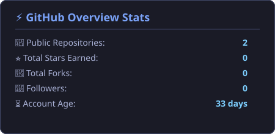
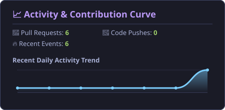
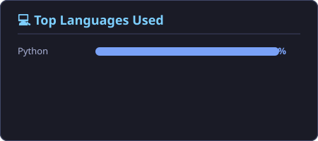

# Hi 👋, I'm Yogesh Saini

  
  

## 🚀 About Me

I'm a developer passionate about building things with code. Currently exploring Python, Data Engineering, and automation.

- 🔭 **Currently working on:** Automated GitHub CI/CD tools and Python pipelines
- 🌱 **Learning:** Data Engineering, Python, Git, and GitHub Actions
- 💬 **Ask me about:** Python automation, REST APIs, and Data pipelines
- 📫 **How to reach me:** [GitHub Profile](https://github.com/yogesh-saini-data)

---

## 🛠️ Tech Stack & Tools

  
  
  
  
  
  

---

## 📊 Analytics & Visual Stats Cards (Custom Generated)

  
  

  

### 📈 Calculated Repository Metrics

<!-- GITHUB_STATS_START -->
<!-- GITHUB_STATS_END -->

---

## 💻 Language Breakdown

<!-- TECHNOLOGIES_START -->
<!-- TECHNOLOGIES_END -->

---

## 🔥 Featured Projects

<!-- PROJECTS_START -->
<!-- PROJECTS_END -->

---

## 📉 Recent Activity

<!-- ACTIVITY_START -->
<!-- ACTIVITY_END -->

---

## 📫 Connect With Me

  

---

<!-- LAST_UPDATED_START -->
<!-- LAST_UPDATED_END -->
